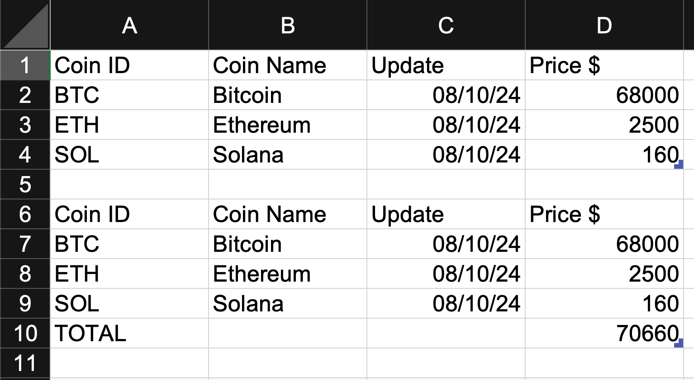
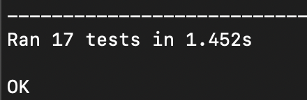

# Crypto sheet updater

## Description
This project allows to quickly update a token portfolio managed in an Apple Numbers or Microsoft Excel spreadsheet.

It takes a spreadsheet file as input, retrieves all the names of the tokens being tracked, contacts CoinMarketCap API to retrieve the latest prices and updates the spreadsheet file.

Configuration is done via the `csu_config.py` file. The documentation related to the variables can be consulted directly in the file, in the form of comments.

## Table of Contents
- [Prerequisites](#prerequisites)
- [Limitations](#limitations)
- [Usage](#usage)
- [Contributing](#contributing)

## Prerequisites
### Python 3
You will need a working Python 3 environment to run the script.
- For Windows or Mac, you can go to https://www.python.org/downloads/ to download and install it. <strong>When installing Python on Windows with the installer tool, check the box "Add python.exe to PATH".</strong>
- For a Debian based Linux, you can run the following command lines:
    ```sh
    sudo apt update
    sudo apt install python3
    ```
### Python dependencies
Once your Python installation is up and running, you'll also need the numbers_parser, openpyxl and requests dependencies. You can install them with pip command:
```sh
pip install numbers_parser openpyxl requests
```

### CoinMarketCap token
To access the CoinMarketCap API, you will need a personal token. To get one go to https://pro.coinmarketcap.com/signup/ , create an account and a personal token on Basic Plan.

### Spreadsheet format
In order for the script to read and edit the spreadsheet correctly, it must include:
- a named table to retrieve and update;
- a column with the token identifier (ex BTC). You can find identifiers on https://coinmarketcap.com with the research function;
- a column with the item price;
- an optional date column, if you wish to update the last update date (see date_col_index in config).

Your spreadsheet may contains multiple sheets, tables or columns in any order, this is not important because you can adapt the script parser via the configuration.

The repository contains two test files (test_sheet) that you can consult. They contain several tables for testing purposes, but only one is needed:\


## Limitations
<strong>For now, token tables must be sorted by Token ID name (BTC, ETH, COL, ...) before running the script.</strong>

## Usage
Either download the project zip and extract it, or clone the repository via the command line, and open the project folder.
```sh
git clone https://github.com/pmghb/crp_sheet_updater.git
cd crp_sheet_updater
```

Open the file `csu_config.py` and adapt the configuration to match your spreadsheet file.

Before running the script, run the test module with one of the following command lines, depending of your OS and Path configuration:
```sh
python -m unittest -v tests.py
```

or 

```sh
python3 -m unittest -v tests.py
```

All tests should pass if your configuration is good:\


If you have an error, check the logs to try to identify the problem. If this seems to be a bug, please create a ticket in the repository.

Otherwise, if all is well, you can run the main script:
```sh
python csu.py
```
You should now have the latest price of all your tokens.

## Contributing
If you wish, you can contribute to the project by submitting new ideas, or directly through pull requests.

You can also support my work by making a donation:
- USDC (BEP20) : 0x334503140dbaeae22c61011403e6c8dadf6d17a5
- BTC (SegWit) : bc1qu7sd0xahdagyj9ta3wenx9xgadjy4lwkk4uvn4
- ETH (ERC20) : 0x75BE08A02fFC8021A96E4264CD8ad393CCE65981
